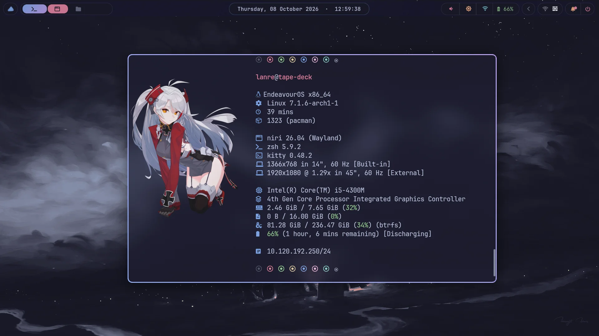
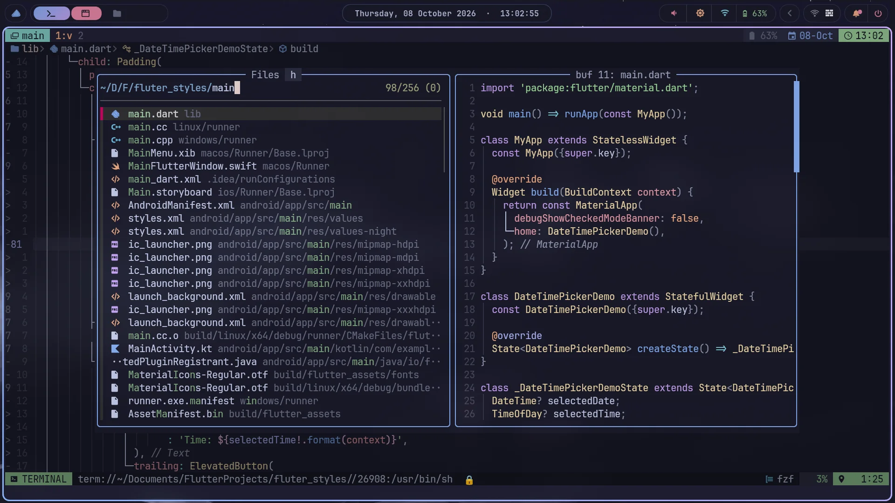
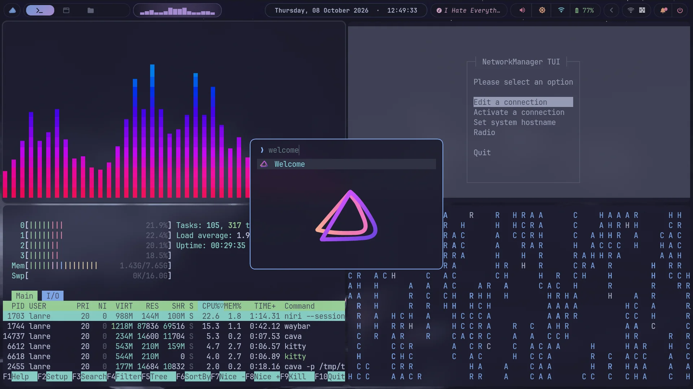

# EndeavourOS / Arch Linux Niri Wayland Dotfiles

[](https://github.com/tty-lanre/my_dotfiles/actions)
[](./LICENSE)
[](https://www.gnu.org/software/stow/)
[](#desktop-stack)

A reproducible **EndeavourOS and Arch Linux Niri Wayland rice** with
developer-focused dotfiles, managed through GNU Stow.

It includes a Catppuccin Mocha desktop built around **Niri**, **Waybar**,
**Fuzzel**, **Kitty**, **Mako**, and **swaylock**, plus a terminal workflow
with **Neovim**, **Tmux**, **Zsh**, Git, Starship, and CLI utilities.

> [!WARNING]
> This repository is personal but designed to be reusable. Review the scripts
> and use `--dry-run` before applying it to a system with existing dotfiles.
> The installer creates links and intentionally does not overwrite conflicts.

## Screenshots

### Niri Wayland workspace



### Neovim development workflow



### Linux terminal utilities



## Desktop stack

| Area | Software |
|---|---|
| Distribution | EndeavourOS / Arch Linux |
| Compositor | Niri on Wayland |
| Status bar | Waybar |
| Application launcher | Fuzzel |
| Terminal emulator | Kitty |
| Editor | Neovim |
| Shell | Zsh |
| Terminal multiplexer | Tmux |
| Notifications | Mako/swaync and Dunst |
| Lock screen | swaylock |
| Theme | Catppuccin Mocha |
| Dotfile manager | GNU Stow |

## Features

- Modular GNU Stow packages, so you can install only the configurations you need.
- Safe `--dry-run` mode and Stow conflict detection; existing files are never overwritten.
- Niri Wayland configuration with Waybar, Fuzzel, Kitty, notifications, and screen locking.
- Developer tooling for Neovim, Tmux, Zsh, Git, Starship, and terminal utilities.
- Optional integrations degrade gracefully when tools such as Starship, fzf,
  zoxide, fnm, eza, or Oh My Zsh are unavailable.
- Bootstrap support for pacman, apt, dnf, Homebrew, and Termux `pkg`.

## Quick start

> [!CAUTION]
> Review `bootstrap.sh` and `install.sh` before running them. The installer
> creates GNU Stow links and stops when it finds conflicts; it does not replace
> existing configuration files.

### Recommended: clone and review

Clone the repository with its submodules, simulate the changes, then install:

```bash
git clone --recurse-submodules [https://github.com/tty-lanre/my_dotfiles.git](https://github.com/tty-lanre/my_dotfiles.git) ~/.dotfiles
cd ~/.dotfiles
./install.sh --dry-run
./install.sh
```

### Remote bootstrap

For a new machine, after reviewing the repository source:

```bash
bash <(curl -fsSL [https://raw.githubusercontent.com/tty-lanre/my_dotfiles/main/bootstrap.sh](https://raw.githubusercontent.com/tty-lanre/my_dotfiles/main/bootstrap.sh))
```

The bootstrap requires Bash, Git, and an internet connection. It clones the
repository into `~/.dotfiles`, initializes bundled submodules, installs missing
base tools, and links the available packages.

The interactive installer asks before installing missing base tools. Use `--yes`
to install without prompting, or `--no-packages` to skip package installation.

Supported package managers are `pacman`, `apt`, `dnf`, Homebrew, and Termux
`pkg`. On systems without one of these, install GNU Stow, Git, Tmux, Zsh, and
Vim manually.

## Selecting packages

By default, the installer links every available Stow package, including
desktop-specific Niri, Waybar, X11, and swaylock configurations. Select only
the packages you need when applying the dotfiles to an existing system:

```bash
./install.sh --package nvim --package git --no-packages
./install.sh --list
./install.sh --target "$HOME/test-dotfiles" --dry-run
```

Available packages:

```text
bin
clipmenu
dunst
fastfetch
fuzzel
git
kitty
lazygit
mako
niri
nvim
picom
scripts
starship
swaylock
tmux
vim
waybar
x11
zsh
```

GNU Stow conflict checks are intentional. If a target already exists and is not
one of this repository's links, Stow reports the conflict and leaves that file
in place. Back up, move, or manually merge the conflicting file, then rerun the
installer. Re-running the installer updates existing links.

## What gets linked

- Most packages map their directory contents into `$HOME`. For example,
  `nvim/.config/nvim` is linked to `~/.config/nvim`.
- `scripts` is linked into `~/bin`.
- `bin` is linked into `~/.local/bin`.
- `.config` remains a normal directory. Stow uses `--no-folding`, so unrelated
  files within `.config` are not hidden by a directory symlink.
- Tmux Plugin Manager is included as a Git submodule. The Tmux configuration
  can install TPM plugins on first launch; downloading plugins requires network
  access.

## Requirements

The installer installs only the base tools required by GNU Stow and the core
terminal configuration:

```text
GNU Stow
Git
Tmux
Zsh
Vim
```

Desktop packages have additional dependencies that vary by package and
distribution. Install applications such as Niri, Kitty, Fuzzel, Waybar, Mako,
swaylock, wallpaper tools, and their dependencies with your system package
manager as needed.

Zsh works without Oh My Zsh. Starship, zoxide, fzf, fnm, eza, and custom Oh My
Zsh plugins are optional and initialize only when installed. Some aliases,
scripts, and desktop keybindings require their corresponding programs.

## Updating

Update the repository and re-apply links from the repository root:

```bash
cd ~/.dotfiles
git pull --ff-only
git submodule update --init --recursive
./install.sh --dry-run
./install.sh
```

Review changes before applying updates, especially changes to shell startup
files, compositor settings, keybindings, or package lists.

## Uninstalling links

Remove selected links from the repository root with GNU Stow:

```bash
stow --dir="$PWD" --target="$HOME" --delete nvim git
stow --dir="$PWD" --target="$HOME/bin" --delete scripts
```

This removes symlinks only. It does not uninstall applications or delete user
data.

## Troubleshooting

### Stow reports a conflict

Stow will not overwrite an existing file. Inspect it, then back it up, move it,
or merge your changes before running the relevant install command again:

```bash
mv ~/.config/nvim ~/.config/nvim.backup.$(date +%F)
./install.sh --package nvim
```

### A command or integration is missing

Some programs are intentionally optional. Install the missing dependency with
your package manager, then restart your shell, terminal, or Wayland session.

### Niri or Waybar does not start

Confirm that Niri, Waybar, and any required dependencies are installed. Package
names and availability can differ on non-Arch distributions, even when the
bootstrap script supports their package manager.

## Repository layout

Each top-level configuration directory is a GNU Stow package. The `scripts/`
package has a separate target at `~/bin`; `pkgs/` contains package lists and is
not linked.

```text
.
├── bin/          # Commands linked to ~/.local/bin
├── niri/         # Niri Wayland compositor configuration
├── nvim/         # Neovim configuration
├── scripts/      # Scripts linked to ~/bin
├── tmux/         # Tmux configuration and TPM integration
├── waybar/       # Waybar configuration
├── zsh/          # Zsh shell configuration
└── pkgs/         # Package lists; not managed by Stow
```

## License

Released under the [MIT License](./LICENSE). Use it, fork it, and improve it.
